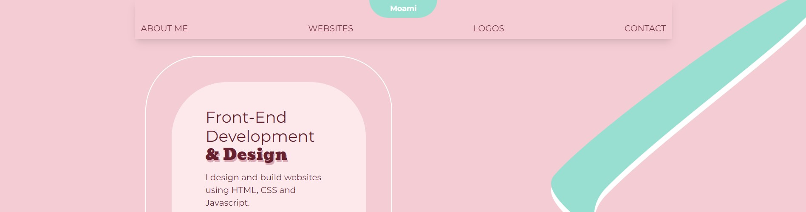

# Portfolio-1.5

  
[Visit deployed site here](https://portfolio-15-moami.netlify.app "Portfolio 1.5")  
[Figma prototype](https://www.figma.com/file/DJ0tUhuOjY36JQinQ3lTK7/Portfolio-1.5?node-id=0%3A1&t=bpATjVk20R16mFji-1 "Figma prototype")

**But the page will be found on it's own domain in short time.**

---

# Process and result

This is the first version of what will be my final portfolio page. I am planning on rebuilding this page with React later.

This page is not quite finished yet. There is a list of things I want to add before I feel satisfied with the result. I want to see if I can find a better way to work around relative items, and also add more information about each of the projects. There is also some missing styling, and the mobile/tablet version is also not optimized.

I also plan on adding more detail to navigation menu, hover-effect, smooth auto-scroll, and maybe some animations. I also want to implement a better display of the projects.

_The page supports dark mode and is set to match the system settings._

---

# Setup

Commands:  
build: npm run build  
preview: npm run preview  
developer mode: npm run dev

---

# Assignment

Create a portfolio page with HTML, CSS and vanilla JS. The page should include some info about yourself, your projects and a way to contact you.

---

<!-- # WCAG color contrast:

source: https://webaim.org/resources/contrastchecker/ -->

<!-- # Things to be done:

- SET UP PROPER DOMAIN
- CURRENT "PAGE" TRACKER
- PORTFOLIOPAGES DROPDOWN INFO ON HOVER
- MOBILE CAROUSEL/SWIPE PORTFOLIO
- FIX BACK-TO-TOP BUTTON DESIGN TO BE MORE VISIBLE
- FIX SHADOW COLOR ON "DESIGN"
- ACHOR LINKS WORK MORE PROPERLY
- MENU SMOOTH SCROLL BETWEEN ANCHORS
- ADD ANIMATIONS AND HOVER EFFECTS
- FIX SPACING AND ALIGNMENT -->
