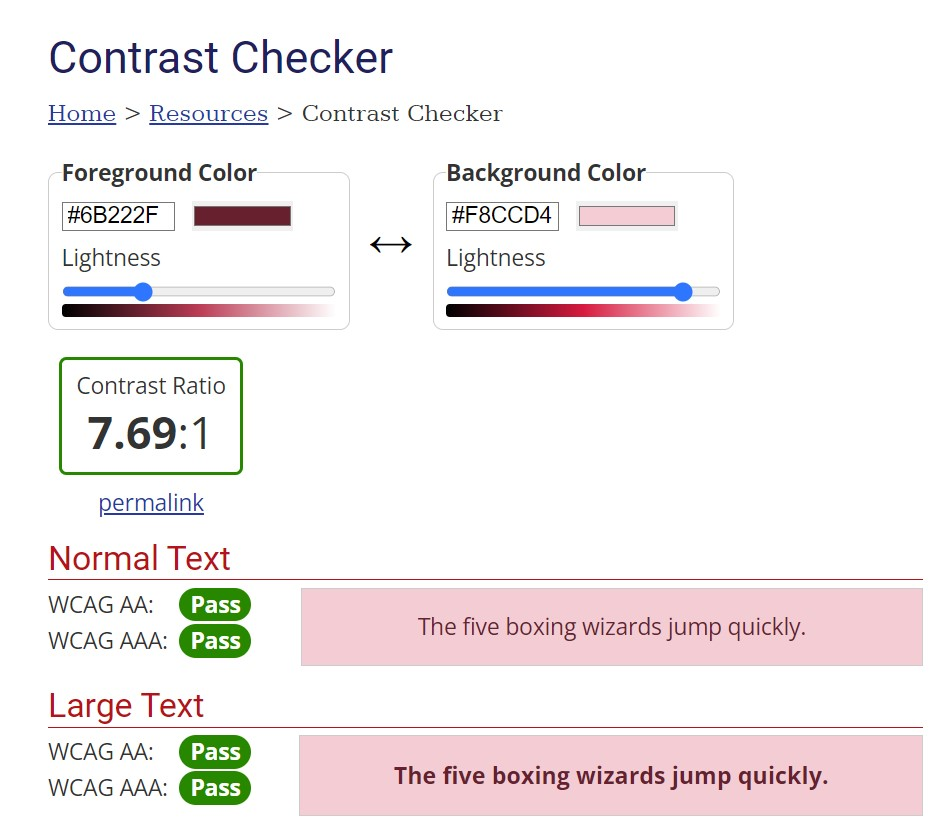

# Portfolio-1.5

Portfolio made with vanilla JS, HTML and TAILWIND-CSS

---

This is the first "draft" of my portfolio page. As it currently stands it is not quite finished and is lacking some styling and optimization. But the page is good enough to serve it's purpose as it currently stands.

The page supports dark mode and is set to match the system settings.

commands:  
build: npm run build  
preview: npm run preview  
developer mode: npm run dev

---

# Hosting

The page is currently only hosted on [Netlify](https://jocular-otter-adb66d.netlify.app/).
But the page will be found on it's own domain in short time.

---

# WCAG color contrast:

source: https://webaim.org/resources/contrastchecker/

---

# Things to be done:

- SET UP PROPER DOMAIN
- CURRENT "PAGE" TRACKER
- PORTFOLIOPAGES DROPDOWN INFO ON HOVER
- MOBILE CAROUSEL/SWIPE PORTFOLIO
- FIX BACK-TO-TOP BUTTON DESIGN TO BE MORE VISIBLE
- FIX SHADOW COLOR ON "DESIGN"
- ACHOR LINKS WORK MORE PROPERLY
- MENU SMOOTH SCROLL BETWEEN ANCHORS
- ADD ANIMATIONS AND HOVER EFFECTS
- FIX SPACING AND ALIGNMENT
